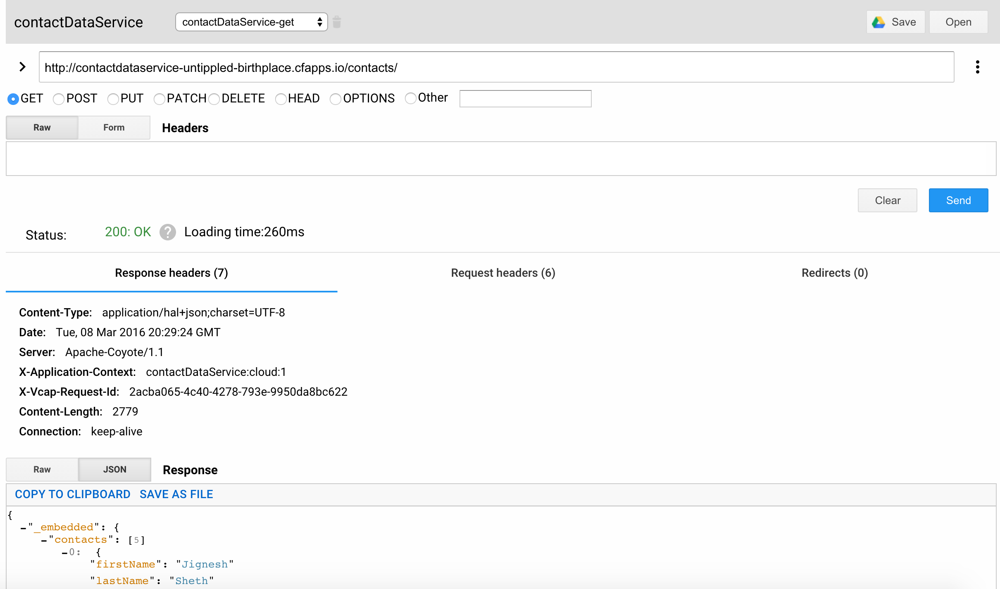
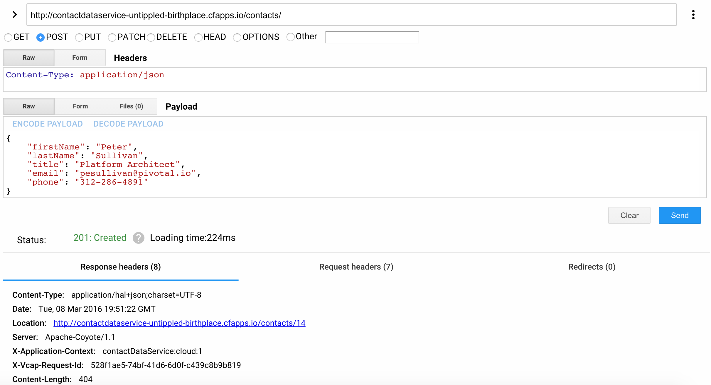
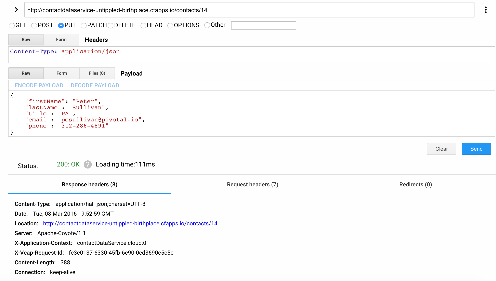
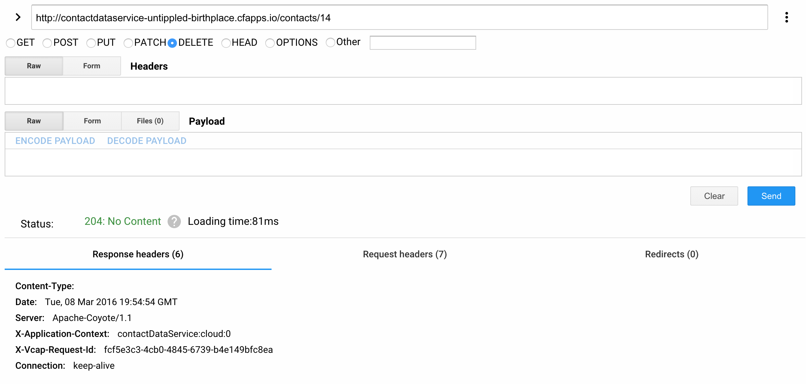

= Lab 1 - From Zero to Pushing Your First Application (Event-Driven Data Service using Spring Boot, JPA & AMQP)

== Target

. If you haven't already, download the latest release of the Cloud Foundry CLI from https://github.com/cloudfoundry/cli/releases for your operating system and install it.

. Optionally, you should install Spring REST Shell (https://github.com/spring-projects/rest-shell#readme) to test out the application. You can also use any other REST client that supports full set of HTTP Methods (PUT, POST, DELETE & GET) such as Advance REST Client (https://chrome.google.com/webstore/detail/advanced-rest-client/hgmloofddffdnphfgcellkdfbfbjeloo)

. Set the API target for the CLI: (set appropriate end point for your environment)
+
----
$ cf api https://api.run.pivotal.io --skip-ssl-validation
----

. Login to Pivotal Cloudfoundry:
+
----
$ cf login
----
+
Follow the prompts

== Push It!

. Change to the _contactDataService_ sample application directory:
+
----
$ cd $WORKSHOP_HOME/lab\ 1/contactDataService
----
. Create Service Instances for contactDataService (set appropriate service and service plan for your environment)
+
----
$ cf m
Getting services from marketplace in org Central / space jigsheth as jsheth@pivotal.io...
OK

service          plans                                                                                description
3scale           free_appdirect, basic_appdirect*, pro_appdirect*                                     API Management Platform
app-autoscaler   bronze, gold                                                                         Scales bound applications in response to load (beta)
blazemeter       free-tier, basic1kmr*, pro5kmr*                                                      Performance Testing Platform
cedexisopenmix   opx_global*, openmix-gslb-with-fusion-feeds*                                         Openmix Global Cloud &amp; Data Center Load Balancer
cedexisradar     free-community-edition                                                               Free Website&amp; Mobile App Performance Reports
cleardb          spark, boost*, amp*, shock*                                                          Highly available MySQL for your Apps.
<cloudamqp>        <lemur>, tiger*, bunny*, rabbit*, panda*                                               Managed HA RabbitMQ servers in the cloud   
cloudforge       free, standard*, pro*                                                                Development Tools In The Cloud
elephantsql      turtle, panda*, hippo*, elephant*                                                    PostgreSQL as a Service
flashreport      trial, basic*, silver*, gold*, platinum*                                             Generate PDF from your data
ironworker       production*, starter*, developer*, lite                                              Job Scheduling and Processing
loadimpact       lifree, li100*, li500*, li1000*                                                      Automated and on-demand performance testing
memcachedcloud   100mb*, 250mb*, 500mb*, 1gb*, 2-5gb*, 5gb*, 30mb                                     Enterprise-Class Memcached for Developers
memcachier       dev, 100*, 250*, 500*, 1000*, 2000*, 5000*, 7500*, 10000*, 20000*, 50000*, 100000*   The easiest, most advanced memcache.
mongolab         sandbox                                                                              Fully-managed MongoDB-as-a-Service
newrelic         standard                                                                             Manage and monitor your apps
<p-mysql>          <100mb>, 1gb, 20gb                                                                     MySQL databases on demand
pubnub           free                                                                                 Build Realtime Apps that Scale
rediscloud       100mb*, 250mb*, 500mb*, 1gb*, 2-5gb*, 5gb*, 10gb*, 50gb*, 30mb                       Enterprise-Class Redis for Developers
searchify        small*, plus*, pro*                                                                  Custom search you control
searchly         small*, micro*, professional*, advanced*, starter, business*, enterprise*            Search Made Simple. Powered-by Elasticsearch
sendgrid         free, bronze*, silver*                                                               Email Delivery. Simplified.
ssl              basic*                                                                               Upload your SSL certificate for your app(s) on your custom domain
stamplay         plus*, premium*, core, starter*                                                      API-first development platform
statica          starter, spike*, micro*, medium*, large*, enterprise*, premium*                      Enterprise Static IP Addresses
temporize        small*, medium*, large*                                                              Simple and flexible job scheduling for your application

* These service plans have an associated cost. Creating a service instance will incur this cost.

TIP:  Use 'cf marketplace -s SERVICE' to view descriptions of individual plans of a given service.

$ cf cs p-mysql 100mb p-mysql
$ cf cs cloudamqp lemur p-rabbitmq
----
. Push the application!
+
----
$ cf push
----
+
You should see output similar to the following listing. Take a look at the listing callouts for a play-by-play of what's happening:
+
====
----
Using manifest file /Users/jsheth/Documents/workspace/Spring-PCF-Workshop/lab 1/contactDataService/manifest.yml <1>

Creating app contactDataService in org Central / space jigsheth as jsheth@pivotal.io...
OK <2>

Creating route contactdataservice-untippled-birthplace.cfapps.io...
OK <3>

Binding contactdataservice-untippled-birthplace.cfapps.io to contactDataService...
OK <4>

Uploading contactDataService... <5>
Uploading app files from: /Users/jsheth/Documents/workspace/Spring-PCF-Workshop/lab 1/contactDataService/target/contactDataService-0.0.1-SNAPSHOT.jar
Uploading 877.6K, 114 files
Done uploading
OK
Binding service p-mysql to app contactDataService in org Central / space jigsheth as jsheth@pivotal.io...
OK <6>
Binding service p-rabbitmq to app contactDataService in org Central / space jigsheth as jsheth@pivotal.io...
OK

Starting app contactDataService in org Central / space jigsheth as jsheth@pivotal.io... <7>
Downloading go_buildpack...
Downloading php_buildpack...
Downloading python_buildpack...
Downloading binary_buildpack...
Downloading liberty_buildpack...
Downloading staticfile_buildpack...
Downloading ruby_buildpack...
Downloading nodejs_buildpack...
Downloading java_buildpack...
Downloaded python_buildpack
Downloaded staticfile_buildpack
Downloaded nodejs_buildpack
Downloaded go_buildpack
Downloaded ruby_buildpack
Downloaded java_buildpack
Downloaded binary_buildpack
Downloaded php_buildpack
Downloaded liberty_buildpack
Creating container
Successfully created container
Downloading app package...
Downloaded app package (28.5M)
Staging...
-----> Java Buildpack Version: v3.6 | https://github.com/cloudfoundry/java-buildpack.git#5194155
-----> Downloading Open Jdk JRE 1.8.0_73 from https://download.run.pivotal.io/openjdk/trusty/x86_64/openjdk-1.8.0_73.tar.gz (0.9s) <8>
       Expanding Open Jdk JRE to .java-buildpack/open_jdk_jre (1.0s)
-----> Downloading Open JDK Like Memory Calculator 2.0.1_RELEASE from https://download.run.pivotal.io/memory-calculator/trusty/x86_64/memory-calculator-2.0.1_RELEASE.tar.gz (0.0s)
       Memory Settings: -Xms768M -XX:MetaspaceSize=104857K -XX:MaxMetaspaceSize=104857K -Xss1M -Xmx768M
-----> Downloading Maria Db JDBC 1.3.6 from https://download.run.pivotal.io/mariadb-jdbc/mariadb-jdbc-1.3.6.jar (0.0s) <9>
-----> Downloading Spring Auto Reconfiguration 1.10.0_RELEASE from https://download.run.pivotal.io/auto-reconfiguration/auto-reconfiguration-1.10.0_RELEASE.jar (0.0s)
Exit status 0
Staging complete
Uploading droplet, build artifacts cache...
Uploading droplet...
Uploading build artifacts cache...
Uploaded build artifacts cache (45M)
Uploaded droplet (73.7M) <10>
Uploading complete

0 of 1 instances running, 1 starting
0 of 1 instances running, 1 starting
0 of 1 instances running, 1 starting
1 of 1 instances running

App started

OK

App contactDataService was started using this command `CALCULATED_MEMORY=$($PWD/.java-buildpack/open_jdk_jre/bin/java-buildpack-memory-calculator-2.0.1_RELEASE -memorySizes=metaspace:64m.. -memoryWeights=heap:75,metaspace:10,native:10,stack:5 -memoryInitials=heap:100%,metaspace:100% -totMemory=$MEMORY_LIMIT) && JAVA_OPTS="-Djava.io.tmpdir=$TMPDIR -XX:OnOutOfMemoryError=$PWD/.java-buildpack/open_jdk_jre/bin/killjava.sh $CALCULATED_MEMORY" && SERVER_PORT=$PORT eval exec $PWD/.java-buildpack/open_jdk_jre/bin/java $JAVA_OPTS -cp $PWD/.:$PWD/.java-buildpack/maria_db_jdbc/maria_db_jdbc-1.3.6.jar:$PWD/.java-buildpack/spring_auto_reconfiguration/spring_auto_reconfiguration-1.10.0_RELEASE.jar org.springframework.boot.loader.JarLauncher`
<11>
Showing health and status for app contactDataService in org Central / space jigsheth as jsheth@pivotal.io...
OK <12>

requested state: started
instances: 1/1
usage: 1G x 1 instances
urls: contactdataservice-untippled-birthplace.cfapps.io
last uploaded: Tue Mar 8 15:23:04 UTC 2016
stack: cflinuxfs2
buildpack: java-buildpack=v3.6-https://github.com/cloudfoundry/java-buildpack.git#5194155 java-main maria-db-jdbc=1.3.6 open-jdk-like-jre=1.8.0_73 open-jdk-like-memory-calculator=2.0.1_RELEASE spring-auto-reconfiguration=1.10.0_RELEASE

     state     since                    cpu    memory         disk           details
#0   running   2016-03-08 09:24:01 AM   0.0%   459.3M of 1G   155.3M of 1G
----
<1> The CLI is using a manifest to provide necessary configuration details such as application name, memory to be allocated, and path to the application artifact.
Take a look at `manifest.yml` to see how.
<2> In most cases, the CLI indicates each Cloud Foundry API call as it happens.
In this case, the CLI has created an application record for _Workshop_ in your assigned space.
<3> All HTTP/HTTPS requests to applications will flow through Cloud Foundry's front-end router called http://docs.cloudfoundry.org/concepts/architecture/router.html[(Go)Router].
Here the CLI is creating a route with random word tokens inserted (again, see `manifest.yml` for a hint!) to prevent route collisions across the default `devcloudwest.inbcu.com` domain.
<4> Now the CLI is _binding_ the created route to the application.
Routes can actually be bound to multiple applications to support techniques such as http://www.mattstine.com/2013/07/10/blue-green-deployments-on-cloudfoundry[blue-green deployments].
<5> The CLI finally uploads the application bits to Pivotal Cloudfoundry. Notice that it's uploading _114 files_! This is because Cloud Foundry actually explodes a ZIP artifact before uploading it for caching purposes and uploads only files that has change from previous push.
<6> Now the CLI is _binding_ the service instances, we created in previous step, to the application. (again, see `manifest.yml` for a hint!)
<7> Now we begin the staging process. The https://github.com/cloudfoundry/java-buildpack[Java Buildpack] is responsible for assembling the runtime components necessary to run the application.
<8> Here we see the version of the JRE that has been chosen and installed.
<9> Here we see the JDBC driver is pulled in automatically, since the mysql service instance is bound to application.
<10> The complete package of your application and all of its necessary runtime components is called a _droplet_.
Here the droplet is being uploaded to Pivotal Cloudfoundry's internal blobstore so that it can be easily copied to one or more _http://docs.cloudfoundry.org/concepts/architecture/execution-agent.html[Droplet Execution Agents (DEA's)]_ for execution.
<11> The CLI tells you exactly what command and argument set was used to start your application.
<12> Finally the CLI reports the current status of your application's health.
====

== Test App

. Visit the application in your browser by hitting the route that was generated by the CLI:

====
----
point the browser to following url: http://contactdataservice-untippled-birthplace.cfapps.io/contacts

Test with Spring REST Shell

$ rest-shell

 ___ ___  __ _____  __  _  _     _ _  __
| _ \ __/' _/_   _/' _/| || |   / / | \ \
| v / _|`._`. | | `._`.| >< |  / / /   > >
|_|_\___|___/ |_| |___/|_||_| |_/_/   /_/
1.2.1.RELEASE

Welcome to the REST shell. For assistance hit TAB or type "help".
http://localhost:8080:> discover http://contactdataservice-untippled-birthplace.cfapps.io/contacts
rel        href
====================================================================================
self       http://contactdataservice-untippled-birthplace.cfapps.io/contacts
profile    http://contactdataservice-untippled-birthplace.cfapps.io/profile/contacts
search     http://contactdataservice-untippled-birthplace.cfapps.io/contacts/search
contact    http://contactdataservice-untippled-birthplace.cfapps.io/contacts/1

http://contactdataservice-untippled-birthplace.cfapps.io/contacts:> get 1
> GET http://contactdataservice-untippled-birthplace.cfapps.io/contacts/1

< 200 OK
< Content-Type: application/hal+json;charset=UTF-8
< Date: Tue, 08 Mar 2016 16:13:20 GMT
< Server: Apache-Coyote/1.1
< X-Application-Context: contactDataService:cloud:0
< X-Vcap-Request-Id: e8f7f653-ba8c-4e68-6404-0983cd80214e
< Content-Length: 379
< Connection: keep-alive
<
{
  "firstName" : "Jig",
  "lastName" : "Sheth",
  "title" : "Mr.",
  "email" : "jigsheth@pivotal.io",
  "phone" : "312-555-1212",
  "id" : 1,
  "_links" : {
    "self" : {
      "href" : "http://contactdataservice-untippled-birthplace.cfapps.io/contacts/1"
    },
    "contact" : {
      "href" : "http://contactdataservice-untippled-birthplace.cfapps.io/contacts/1"
    }
  }
}
http://contactdataservice-untippled-birthplace.cfapps.io/contacts:> post --data "{firstName: 'Peter', lastName: 'Sullivan', title: 'Platform Architect', email: 'pesullivan@pivotal.io', phone: '312-286-4891'}"
> POST http://contactdataservice-untippled-birthplace.cfapps.io/contacts/

< 201 CREATED
< Content-Type: application/hal+json;charset=UTF-8
< Date: Tue, 08 Mar 2016 16:15:52 GMT
< Location: http://contactdataservice-untippled-birthplace.cfapps.io/contacts/2
< Server: Apache-Coyote/1.1
< X-Application-Context: contactDataService:cloud:0
< X-Vcap-Request-Id: 198a3f2d-7c21-4c45-5f50-d3472adbaa4b
< Content-Length: 401
< Connection: keep-alive
<
{
  "firstName" : "Peter",
  "lastName" : "Sullivan",
  "title" : "Platform Architect",
  "email" : "pesullivan@pivotal.io",
  "phone" : "312-286-4891",
  "id" : 2,
  "_links" : {
    "self" : {
      "href" : "http://contactdataservice-untippled-birthplace.cfapps.io/contacts/2"
    },
    "contact" : {
      "href" : "http://contactdataservice-untippled-birthplace.cfapps.io/contacts/2"
    }
  }
}
http://contactdataservice-untippled-birthplace.cfapps.io/contacts:> put 1 --data "{firstName: 'Jig', lastName: 'Sheth', title: 'Platform Architect', email: 'jsheth@pivotal.io', phone: '847-970-0298'}"
> PUT http://contactdataservice-untippled-birthplace.cfapps.io/contacts/1

< 200 OK
< Content-Type: application/hal+json;charset=UTF-8
< Date: Tue, 08 Mar 2016 16:18:13 GMT
< Location: http://contactdataservice-untippled-birthplace.cfapps.io/contacts/1
< Server: Apache-Coyote/1.1
< X-Application-Context: contactDataService:cloud:0
< X-Vcap-Request-Id: d9419d4d-7ffc-410d-7cd7-c631f5408226
< Content-Length: 392
< Connection: keep-alive
<
{
  "firstName" : "Jig",
  "lastName" : "Sheth",
  "title" : "Platform Architect",
  "email" : "jsheth@pivotal.io",
  "phone" : "847-970-0298",
  "id" : 1,
  "_links" : {
    "self" : {
      "href" : "http://contactdataservice-untippled-birthplace.cfapps.io/contacts/1"
    },
    "contact" : {
      "href" : "http://contactdataservice-untippled-birthplace.cfapps.io/contacts/1"
    }
  }
}
http://contactdataservice-untippled-birthplace.cfapps.io/contacts:> get self
> GET http://contactdataservice-untippled-birthplace.cfapps.io/contacts

< 200 OK
< Content-Type: application/hal+json;charset=UTF-8
< Date: Tue, 08 Mar 2016 16:18:42 GMT
< Server: Apache-Coyote/1.1
< X-Application-Context: contactDataService:cloud:0
< X-Vcap-Request-Id: d023c705-7088-416e-4b7a-da76201573ea
< Content-Length: 1415
< Connection: keep-alive
<
{
  "_embedded" : {
    "contacts" : [ {
      "firstName" : "Jig",
      "lastName" : "Sheth",
      "title" : "Platform Architect",
      "email" : "jsheth@pivotal.io",
      "phone" : "847-970-0298",
      "id" : 1,
      "_links" : {
        "self" : {
          "href" : "http://contactdataservice-untippled-birthplace.cfapps.io/contacts/1"
        },
        "contact" : {
          "href" : "http://contactdataservice-untippled-birthplace.cfapps.io/contacts/1"
        }
      }
    }, {
      "firstName" : "Peter",
      "lastName" : "Sullivan",
      "title" : "Platform Architect",
      "email" : "pesullivan@pivotal.io",
      "phone" : "312-286-4891",
      "id" : 2,
      "_links" : {
        "self" : {
          "href" : "http://contactdataservice-untippled-birthplace.cfapps.io/contacts/2"
        },
        "contact" : {
          "href" : "http://contactdataservice-untippled-birthplace.cfapps.io/contacts/2"
        }
      }
    } ]
  },
  "_links" : {
    "self" : {
      "href" : "http://contactdataservice-untippled-birthplace.cfapps.io/contacts"
    },
    "profile" : {
      "href" : "http://contactdataservice-untippled-birthplace.cfapps.io/profile/contacts"
    },
    "search" : {
      "href" : "http://contactdataservice-untippled-birthplace.cfapps.io/contacts/search"
    }
  },
  "page" : {
    "size" : 20,
    "totalElements" : 2,
    "totalPages" : 1,
    "number" : 0
  }
}
----

. Test using Advance REST Client (Chrome App)

.. Retrieve existing Contact
+

.. Create new Contact
+

.. Update existing Contact
+

.. Delete existing Contact
+

====

== Interact with App from CF CLI

. Get information about the currently deployed application using CLI apps command:
+
----
$ cf apps
----
+
Note the application name for next steps

. Get information about running instances, memory, CPU, and other statistics using CLI instances command
+
----
$ cf app <<app_name>>
----
. Scale the application using CLI instances command
+
----
$ cf scale <<app_name>> -i 2
----
. kill the container and see how PCF auto-heals it self
+
----
$ cd $WORKSHOP_HOME
$ ./kill_app_instance <<app_name>> 1
----
. Stop the deployed application using the CLI
+
----
$ cf stop <<app_name>>
----
. Delete the deployed application using the CLI
+
----
$ cf delete <<app_name>> -r
----
