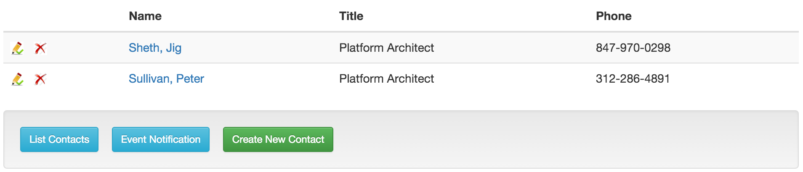
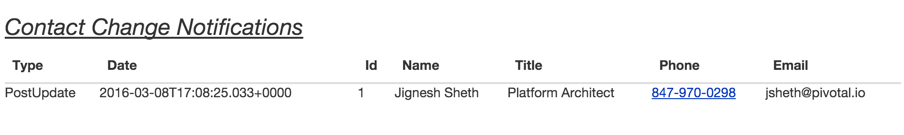

= Lab 2 - Responsive Web UI for Contact Data Service Application

== Background

This application is a front-end mobile-first Web Application for the Contact Data Service using Spring Boot, AngularJS & AMQP. This web application allows you to create, retrieve, update, & delete Contact using Contact Data Service. The web application also provides user interface to monitor the publish change event by Contact Data Service.

== Push It!

. Change to the _contactWebApp_ sample application directory:
+
----
$ cd $WORKSHOP_HOME/lab2/contactWebApp
----
. Create Service Instances for contactWebApp
.. Note: We are **creating a user provided service instance**. This service instance will allow contactWebApp to locate and communicate with contactDataService. We are also **creating Redis service instance** to externalize the HTTP Session, so you can scale and loadbalance webapp without loosing session data.
.. Note: replace the uri value below with your contactDataService uri. You can obtain the contactDataService uri by executing command: **cf apps**
+
[source,bash]
----
$ cf apps

Getting apps in org pcfdev-org / space pcfdev-space as admin...
OK

name                 requested state   instances   memory   disk   urls   
configserver         started           1/1         512M     512M   configserver.local.pcfdev.io   
eurekaserver         started           1/1         512M     512M   eurekaserver.local.pcfdev.io   
dataloadService      started           1/1         512M     512M   dataloadservice-unvarnished-teacake.local.pcfdev.io   
contactDataService   started           1/1         256M     512M   contactdataservice-nonvulcanized-brier.local.pcfdev.io

$ cf cups contact-service -p "tag,uri"

tag> contact-service

uri> contactdataservice-nonvulcanized-brier.local.pcfdev.io
Creating user provided service contact-service in org pcfdev-org / space pcfdev-space as admin...
OK

$ cf cs p-redis shared-vm p-redis
----
. Push the application!
+
----
$ cf push
----
+
You should see output similar to the following listing. Take a look at the listing callouts for a play-by-play of what's happening:
+
====
[source,bash]
----
Using manifest file /Users/jsheth/Documents/workspace/Spring-PCF-Workshop/lab2/contactWebApp/manifest.yml  // <1>

Creating app contactWebApp in org pcfdev-org / space pcfdev-space as admin...
OK //<2>

Creating route contactwebapp-kempy-gemination.local.pcfdev.io...
OK //<3>

Binding contactwebapp-kempy-gemination.local.pcfdev.io to contactWebApp...
OK //<4>

Uploading contactWebApp... 
Uploading app files from: /Users/jsheth/Documents/workspace/Spring-PCF-Workshop/lab2/contactWebApp/target/contactWebApp-0.0.1-SNAPSHOT.jar
Uploading 692.6K, 125 files  //<5>
Done uploading               
OK
Binding service p-redis to app contactWebApp in org pcfdev-org / space pcfdev-space as admin...
OK //<6>
Binding service p-rabbitmq to app contactWebApp in org pcfdev-org / space pcfdev-space as admin...
OK 
Binding service contact-service to app contactWebApp in org pcfdev-org / space pcfdev-space as admin...
OK 

Starting app contactWebApp in org pcfdev-org / space pcfdev-space as admin... //<7>
Downloading binary_buildpack...
Downloading ruby_buildpack...
Downloading php_buildpack...
Downloading nodejs_buildpack...
Downloading python_buildpack...
Downloading go_buildpack...
Downloading staticfile_buildpack...
Downloading java_buildpack...
Downloaded php_buildpack
Downloaded go_buildpack
Downloaded staticfile_buildpack
Downloaded java_buildpack
Downloaded nodejs_buildpack
Downloaded ruby_buildpack
Downloaded python_buildpack
Downloaded binary_buildpack
Creating container
Successfully created container
Downloading app package...
Downloaded app package (16M)
Staging...
-----> Java Buildpack Version: v3.6 (offline) | https://github.com/cloudfoundry/java-buildpack.git#5194155
-----> Downloading Open Jdk JRE 1.8.0_71 from https://download.run.pivotal.io/openjdk/trusty/x86_64/openjdk-1.8.0_71.tar.gz (found in cache) //<8>
       Expanding Open Jdk JRE to .java-buildpack/open_jdk_jre (0.9s)
-----> Downloading Open JDK Like Memory Calculator 2.0.1_RELEASE from https://download.run.pivotal.io/memory-calculator/trusty/x86_64/memory-calculator-2.0.1_RELEASE.tar.gz (found in cache)
       Memory Settings: -XX:MetaspaceSize=64M -Xss995K -Xmx382293K -XX:MaxMetaspaceSize=64M -Xms382293K
-----> Downloading Spring Auto Reconfiguration 1.10.0_RELEASE from https://download.run.pivotal.io/auto-reconfiguration/auto-reconfiguration-1.10.0_RELEASE.jar (found in cache)
Exit status 0
Staging complete
Uploading droplet, build artifacts cache...
Uploading build artifacts cache...
Uploading droplet...
Uploaded build artifacts cache (107B)
Uploaded droplet (61M)  //<9>
Uploading complete

0 of 1 instances running, 1 starting
1 of 1 instances running

App started

OK

App contactWebApp was started using this command `CALCULATED_MEMORY=$($PWD/.java-buildpack/open_jdk_jre/bin/java-buildpack-memory-calculator-2.0.1_RELEASE -memorySizes=metaspace:64m.. -memoryWeights=heap:75,metaspace:10,native:10,stack:5 -memoryInitials=heap:100%,metaspace:100% -totMemory=$MEMORY_LIMIT) && JAVA_OPTS="-Djava.io.tmpdir=$TMPDIR -XX:OnOutOfMemoryError=$PWD/.java-buildpack/open_jdk_jre/bin/killjava.sh $CALCULATED_MEMORY" && SERVER_PORT=$PORT eval exec $PWD/.java-buildpack/open_jdk_jre/bin/java $JAVA_OPTS -cp $PWD/.:$PWD/.java-buildpack/spring_auto_reconfiguration/spring_auto_reconfiguration-1.10.0_RELEASE.jar org.springframework.boot.loader.JarLauncher` //<10>

Showing health and status for app contactWebApp in org pcfdev-org / space pcfdev-space as admin...
OK //<11>

requested state: started
instances: 1/1
usage: 512M x 1 instances
urls: contactwebapp-kempy-gemination.local.pcfdev.io
last uploaded: Sat May 21 00:06:47 UTC 2016
stack: cflinuxfs2
buildpack: java-buildpack=v3.6-offline-https://github.com/cloudfoundry/java-buildpack.git#5194155 java-main open-jdk-like-jre=1.8.0_71 open-jdk-like-memory-calculator=2.0.1_RELEASE spring-auto-reconfiguration=1.10.0_RELEASE

     state     since                    cpu    memory      disk        details   
#0   running   2016-05-20 07:07:16 PM   0.0%   0 of 512M   0 of 512M      
----
<1> The CLI is using a manifest to provide necessary configuration details such as application name, memory to be allocated, and path to the application artifact.
Take a look at `manifest.yml` to see how.
<2> In most cases, the CLI indicates each Cloud Foundry API call as it happens.
In this case, the CLI has created an application record for _Workshop_ in your assigned space.
<3> All HTTP/HTTPS requests to applications will flow through Cloud Foundry's front-end router called http://docs.cloudfoundry.org/concepts/architecture/router.html[(Go)Router].
Here the CLI is creating a route with random word tokens inserted (again, see `manifest.yml` for a hint!) to prevent route collisions across the default `local.pcfdev.io` domain.
<4> Now the CLI is _binding_ the created route to the application.
Routes can actually be bound to multiple applications to support techniques such as http://www.mattstine.com/2013/07/10/blue-green-deployments-on-cloudfoundry[blue-green deployments].
<5> The CLI finally uploads the application bits to Pivotal Cloudfoundry. Notice that it's uploading _125 files_! This is because Cloud Foundry actually explodes a ZIP artifact before uploading it for caching purposes and uploads only files that has change from previous push.
<6> Now the CLI is _binding_ the service instances, we created in previous step, to the application. (again, see `manifest.yml` for a hint!)
<7> Now we begin the staging process. The https://github.com/cloudfoundry/java-buildpack[Java Buildpack] is responsible for assembling the runtime components necessary to run the application.
<8> Here we see the version of the JRE that has been chosen and installed.
<9> The complete package of your application and all of its necessary runtime components is called a _droplet_.
Here the droplet is being uploaded to Pivotal Cloudfoundry's internal blobstore so that it can be easily copied to one or more _http://docs.cloudfoundry.org/concepts/architecture/execution-agent.html[Droplet Execution Agents (DEA's)]_ for execution.
<10> The CLI tells you exactly what command and argument set was used to start your application.
<11> Finally the CLI reports the current status of your application's health.
====

==== Test the application using browser

. Visit the application in your browser by hitting the route that was generated by the CLI:
+
====

. point the browser to your application url. For example: http://contactwebapp-kempy-gemination.local.pcfdev.io
+

. Click on Even Notification button and See the events being generated when interacting with contactDataService. contactDataService will publish any events that modifies the Domain Model to RabbitMQ.
+

====

== Interact with App from CF CLI

. Get information about the currently deployed application using CLI apps command:
+
----
$ cf apps
----
+
Note the application name for next steps

. Get information about running instances, memory, CPU, and other statistics using CLI instances command
+
----
$ cf app contactWebApp
----
. Scale the application using CLI instances command and use the browser in "Incognito" mode to access the applicaion. Observe the behavior and notice **User's sessionid** and **Application Instance #**. As you refresh the browser, you will be loadbalancing across multiple instance of the app, but sessionid will remain same.
+
----
$ cf scale contactWebApp -i 2
----
. kill the container and see how PCF auto-heals it self
+
----
$ cd $WORKSHOP_HOME
$ ./kill_app_instance contactwebapp 0

Note: for windows user, you can execute following commands:
$ cf app contactWebApp --guid
Note: copy the guid value from above response and relace it with ${GUID} below:
$ cf curl /v2/apps/${GUID}/instances/${INSTANCE#} -X 'DELETE'

Now you can monitor the app for auto healing
$ cf app contactWebApp
----
. Stop the deployed application using the CLI
+
----
$ cf sp contactWebApp
$ cf sp contactDataService
----
. Delete the deployed application using the CLI
+
----
$ cf d -r contactWebApp
$ cf d -r contactDataService
----
. Delete the service instances created previously using the CLI
+
----
$ cf ds p-mysql -f
$ cf ds p-rabbitmq -f
$ cf ds contact-service -f
$ cf ds p-redis -f
----
